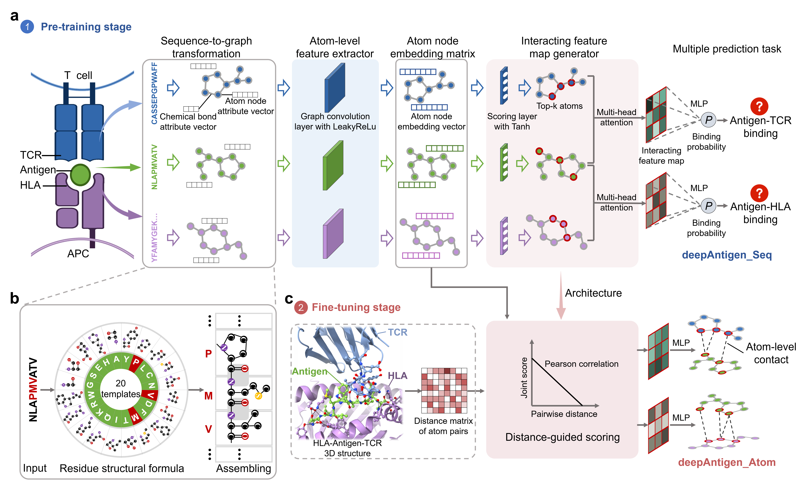

.. deepAntigen documentation master file, created by
   sphinx-quickstart on Sat Feb 20 12:08:49 2023.
   You can adapt this file completely to your liking, but it should at least
   contain the root `toctree` directive.

deepAntigen 
==========================
Identifying T cell antigen at the atom level with graph convolutional network.

.. toctree::
   :maxdepth: 1
   :hidden:
   
   installation
   tutorials